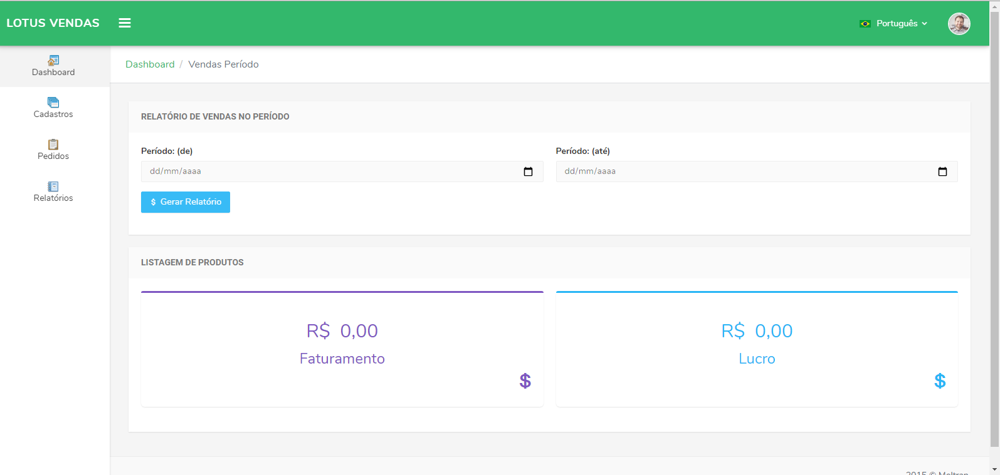

<h4 align="center">
  🚀 Sistema de Vendas - Teste técnico
</h4>

<p align="center">
 

  
</p>

<p align="center">
  <a href="#rocket-tecnologias">Tecnologias</a>&nbsp;&nbsp;&nbsp;|&nbsp;&nbsp;&nbsp;
  <a href="#-projeto">Projeto</a>&nbsp;&nbsp;&nbsp;|&nbsp;&nbsp;&nbsp;
  <a href="#-funcionalidades">Funcionalidades</a>&nbsp;&nbsp;&nbsp;|&nbsp;&nbsp;&nbsp;
  <a href="#-requisitos">Requisitos</a>&nbsp;&nbsp;&nbsp;|&nbsp;&nbsp;&nbsp;
  <a href="#-instalação">Instalação</a>&nbsp;&nbsp;&nbsp;|&nbsp;&nbsp;&nbsp;
</p>

<br>

<p align="center">
  
</p>

## :rocket: Tecnologias

Esse projeto foi desenvolvido com as seguintes tecnologias:

- [Angular 9](https://nodejs.org/en/)


## 💻 Projeto

Lotus Sales é um sistema feito como teste técnico para o processo seletivo de programador fullstack Lotus Experience


## 💻 Funcionalidades

O sistema possui cadastros de categorias, produtos, realização da venda e relatórios de faturamento, lucro, e 
top 10 produtos mais e menos vendidos


## 📄 Requisitos

* PHP 7.3+, Laravel 7+, MySQL 5.7+ e Docker


## ⚙️ Instalação e execução

**Windows, OS X & Linux:**

Baixe o arquivo zip e o descompacte ou baixe o projeto para sua máquina através do git clone [https://github.com/randercarlos/lotus-sales-frontend.git](https://github.com/randercarlos/lotus-sales-frontend.git)


- Entre no prompt de comando e vá até a pasta do projeto:

```sh
cd ir-ate-a-pasta-do-projeto
```

- Crie o arquivo .env a partir do arquivo .env.example. As variáveis de ambiente relacionadas ao banco já estão configuradas.
Será necessário alterar somente às relativas ao email. Sugiro criar uma conta gratuita no site
http://mailtrap.io e alterar as variáveis de ambiente relacionadas ao email:

```sh
copy .env.example .env
```

- Assumindo que tenha o docker instalado na máquina, execute o comando:

```sh
docker-compose up
```

- Aguarde até que toda os serviços estejam ativos e as dependências do laravel estejam instaladas e as migrações instaladas. 
No final, o Docker  mostrará uma mensagem de que o Laravel estará rodando em [http://localhost:4200](http://localhost:4200).

## Endpoints do Sistema

### Categorias

* [Exibe Todas as Categorias]() : `GET http://localhost:3000/api/categories` `Status: 200 Ok`
* [Cria Uma Categoria]() : `POST http://localhost:3000/api/categories` `Status: 201 Created OR status: 422 Unprocessable Entity`
```javascript
{
	 name (string, required): "Frutas, Verduras e Legumes",
	 description (string, optional): "Categoria de Frutas, Verduras e Legumes"
}
```
* [Exibe Uma Categoria]() : `GET http://localhost:3000/api/categories/:id/` `Status: 200 Ok OR status: 404 not found`
* [Atualiza Uma Categoria]() : `PUT http://localhost:3000/api/accounts/:id/` `Status: 200 Ok OR status: 404 not found OR status: 422 Unprocessable Entity`
```javascript
{
	 name (string, required): "Frutas, Verduras e Legumes",
	 description (string, optional): "Categoria de Frutas, Verduras e Legumes"
}
```
* [Deleta uma Categoria]() : `DELETE http://localhost:3000/api/accounts/:id/` `Status: 200 Ok OR status: 404 not found`


### Produtos

* [Exibe Todos os Produtos]() : `GET http://localhost:3000/api/products` `Status: 200 Ok`
* [Cria Um Produto]() : `POST http://localhost:3000/api/products` `Status: 201 Created OR status: 422 Unprocessable Entity`
```javascript
{
	 name (string, required): "Frutas, Verduras e Legumes",
	 description (string, optional): "Categoria de Frutas, Verduras e Legumes"
}
```
* [Exibe Um Produto]() : `GET http://localhost:3000/api/products/:id/` `Status: 200 Ok OR status: 404 not found`
* [Atualiza Um Produto]() : `PUT http://localhost:3000/api/products/:id/` `Status: 200 Ok OR status: 404 not found OR status: 422 Unprocessable Entity`
```javascript
{
	 name (string, required): "Guaraná Antártica 2L",
	 category_id (integer, required): 2,
	 cost_price (decimal, required): 2.86,
	 sale_price (decimal, required): 3.70,
	 units_stock (integer, required): 46,
	 active (boolean->true/false, required): true,
	 photo (file/image, optional): binary file,
}
```
* [Deleta Um Produto]() : `DELETE http://localhost:3000/api/products/:id/` `Status: 200 Ok OR status: 404 not found`

### Vendas

* [Exibe Todos as Vendas]() : `GET http://localhost:3000/api/orders` `Status: 200 Ok`
* [Cria Uma Venda]() : `POST http://localhost:3000/api/orders` `Status: 201 Created OR status: 422 Unprocessable Entity`
```javascript
{
	 order_date (date, required): "2020-07-22",
	 order_details (detail array, required (min 1 item)): [
        {
             product: {
                name (string, required): "Guaraná Antártica 2L",
                category_id (integer, required): 2,
                cost_price (decimal, required): 2.86,
                sale_price (decimal, required): 3.70,
                units_stock (integer, required): 46,
                active (boolean->true/false, required): true,
                photo (file/image, optional): binary file,
             },
             unit_price (decimal, required): 3.70,
             qtd (number, required): 3
        },
        {
             product: {
                name (string, required): "Coca Cola 2L",
                category_id (integer, required): 2,
                cost_price (decimal, required): 3.90,
                sale_price (decimal, required): 5.80,
                units_stock (integer, required): 76,
                active (boolean->true/false, required): true,
                photo (file/image, optional): binary file,
             },
             unit_price (decimal, required): 5.90,
             qtd (number, required): 1
        }
    ]   
}
```

### Relatório de Faturamento e Lucro Por Período

* [Exibe O Faturamento e o Lucro]() : `GET http://localhost:3000/api/reports/sales_period` `Status: 200 Ok`
```javascript
{
	 from (date, optional): "2020-01-01",
	 to (date, optional): "2020-12-31",
}
```

### Relatório de Top 10 Produtos Mais e Menos Vendidos

* [Exibe top 10 Produtos]() : `GET http://localhost:3000/api/reports/top10_product_sales` `Status: 200 Ok`
```javascript
{
	 type (integer, optional): 1 (mais vendidos) ou 2 (menos vendidos) 
}
```

### Preview de Email com dados de Total de Vendas, Faturamento, lucro, Top 10 Produtos Mais e Menos Vendidos

* [Exibir email com dados de venda]() : `GET http://localhost:3000/api/reports/email_preview` `Status: 200 Ok`

Desenvolvido por Rander Carlos :wave: [Linkedin!](https://www.linkedin.com/in/rander-carlos-caetano-freitas-308a63a8/)
